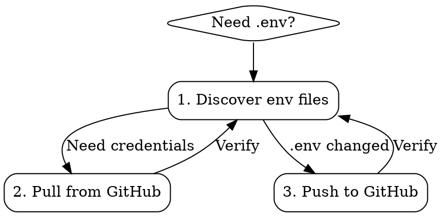

# gh-env-sync

## Overview

Manage `.env` files using `gh` (GitHub CLI) — discover existing env files in the project, pull repo variables/secrets into `.env`, and push local `.env` changes back to GitHub.

**Core principle:** `.env` is the single source of truth locally; GitHub Variables + Secrets are the single source of truth remotely. This skill keeps them in sync.

## When to Use

- Starting work on a project that needs environment variables
- After cloning a repo and needing local credentials
- When `.env` changes and GitHub secrets need updating
- When switching between projects and needing to restore env context
- When onboarding new developers to a project

## Flowchart



## Quick Reference

| Action | Command |
|--------|---------|
| Discover env files | `find . -maxdepth 3 -name '.env*' -not -path '*/node_modules/*' -not -path '*/.git/*'` |
| Pull all variables | `gh variable list --json name,value -q '.[] \| "\(.name)=\(.value)"' > .env` |
| Pull variables (append) | `gh variable list --json name,value -q '.[] \| "\(.name)=\(.value)"' >> .env` |
| Push as secrets | `gh secret set -f .env` |
| List existing secrets | `gh secret list` |
| List existing variables | `gh variable list` |
| Set single secret | `gh secret set SECRET_NAME < value.txt` |
| Set single variable | `gh variable set VAR_NAME < value.txt` |
| Delete a secret | `gh secret delete SECRET_NAME` |
| Delete a variable | `gh variable delete VAR_NAME` |

## Step 1: Discover Env Files

Before pulling or pushing, scan the project to understand what already exists:

```bash
# Find all .env-related files in the project
find . -maxdepth 3 -name '.env*' -not -path '*/node_modules/*' -not -path '*/.git/*' | sort
```

**Decision logic:**

- **`.env` exists** → Check if it has values or just keys. If empty/template, pull from GitHub.
- **Only `.env.example` exists** → Use it as the template for keys. Pull values from GitHub.
- **No env files** → Pull everything from GitHub to create `.env`.
- **Multiple `.env.*` (`.env.local`, `.env.production`)** → Ask which to sync.

**Check `.env` status:**

```bash
# Count lines and check if values are filled
wc -l .env
# See which keys have empty values
grep -c '=$' .env
```

## Step 2: Pull from GitHub

### Full pull (overwrite `.env`)

```bash
gh variable list --json name,value -q '.[] | "\(.name)=\(.value)"' > .env
```

### Append to existing `.env`

```bash
gh variable list --json name,value -q '.[] | "\(.name)=\(.value)"' >> .env
# Remove duplicate keys (keep last occurrence)
awk -F= '!seen[$1]++ {a[$1]=$0} END {for(k in a) print a[k]}' .env > .env.tmp && mv .env.tmp .env
```

### Pull with `.env.example` as template

When `.env.example` defines the expected keys (with empty values) and GitHub has the actual values:

```bash
# Create .env from example
cp .env.example .env
# Pull values from GitHub
gh variable list --json name,value -q '.[] | "\(.name)=\(.value)"' > /tmp/gh_vars.env
# Merge: fill .env keys with GitHub values, keep structure
while IFS='=' read -r key value; do
  if grep -q "^${key}=" .env; then
    sed -i '' "s|^${key}=.*|${key}=${value}|" .env
  else
    echo "${key}=${value}" >> .env
  fi
done < /tmp/gh_vars.env
rm /tmp/gh_vars.env
```

### Scope options

GitHub CLI supports different scopes for variables and secrets:

```bash
# Repository level (default)
gh variable list

# Organization level
gh variable list --org ORG_NAME

# Environment level (e.g., production)
gh variable list --env production

# Repository + Environment
gh variable list --repo OWNER/REPO --env production
```

## Step 3: Push to GitHub

When `.env` changes, sync secrets back to GitHub:

```bash
# Push ALL key=value pairs as secrets (encrypted)
gh secret set -f .env
```

### Push specific variables (non-secret, visible in UI)

```bash
# Set one variable at a time
while IFS='=' read -r key value; do
  [[ -n "$key" && ! "$key" =~ ^# ]] && gh variable set "$key" -b "$value"
done < .env
```

### Selective push (only changed keys)

```bash
# Diff against last synced version
diff .env .env.last-sync 2>/dev/null || true
# Push only changed secrets
gh secret set -f .env  # gh handles dedup — only changed values are updated
```

### With scope

```bash
# Push to a specific environment
gh secret set -f .env --env production

# Push to organization
gh secret set -f .env --org ORG_NAME

# Push to specific repo (when not in repo directory)
gh secret set -f .env --repo OWNER/REPO
```

## Important: Variables vs Secrets

| Property | `gh variable` | `gh secret` |
|----------|--------------|-------------|
| Visibility | Values visible in GitHub UI | Values encrypted, never shown |
| Set command | `gh variable set NAME` | `gh secret set NAME` |
| List command | `gh variable list --json name,value` | `gh secret list` (names only) |
| Retrieve values | ✅ Via `gh variable list` | ❌ Cannot retrieve values |
| Use in Actions | `${{ vars.NAME }}` | `${{ secrets.NAME }}` |
| Use in Codespaces | ✅ Automatic | ✅ Automatic |

**Key insight:** You can only PULL values from `gh variable`. Secrets are write-only — you can push but never read them back. Design your `.env` strategy accordingly.

## Common Mistakes

| Mistake | Fix |
|---------|-----|
| Pushing secrets then trying to pull them back | Secrets are write-only. Store a local backup or use variables for non-sensitive config. |
| Overwriting `.env` without backup | Always `cp .env .env.bak` before pull. |
| Forgetting `--env` or `--repo` flags | Defaults to current repo's repo-level scope. Confirm target before push. |
| Committing `.env` to git | Verify `.env` is in `.gitignore` before any operation. |
| Using `gh variable list` without `--json` | Plain `gh variable list` output is not parseable. Always use `--json name,value`. |
| Mixing quotes in values | Use single quotes around the entire `jq`/`-q` expression to avoid shell interpolation. |

## Safety Checklist

Before any `.env` operation:

1. **Verify `.gitignore`** — Confirm `.env` is ignored: `grep -c '.env' .gitignore`
2. **Backup existing** — `cp .env .env.bak` before overwriting
3. **Dry-run push** — `gh secret list` to see what already exists before overwriting
4. **Review content** — `cat .env` to confirm no unintended values before pushing

## Real-World Patterns

### Fresh clone setup

```bash
# 1. Discover
find . -maxdepth 2 -name '.env*' | sort
# 2. Pull all variables
gh variable list --json name,value -q '.[] | "\(.name)=\(.value)"' > .env
# 3. Verify
cat .env
# 4. Done — app reads .env locally
```

### After changing `.env` locally

```bash
# 1. Review diff
git diff .env 2>/dev/null || diff .env.bak .env
# 2. Push secrets to GitHub
gh secret set -f .env
# 3. Verify
gh secret list
```

### Multi-environment project (`.env.production`, `.env.staging`)

```bash
# Pull production variables
gh variable list --env production --json name,value -q '.[] | "\(.name)=\(.value)"' > .env.production
# Pull staging variables
gh variable list --env staging --json name,value -q '.[] | "\(.name)=\(.value)"' > .env.staging
# Push production secrets
gh secret set -f .env.production --env production
# Push staging secrets
gh secret set -f .env.staging --env staging
```